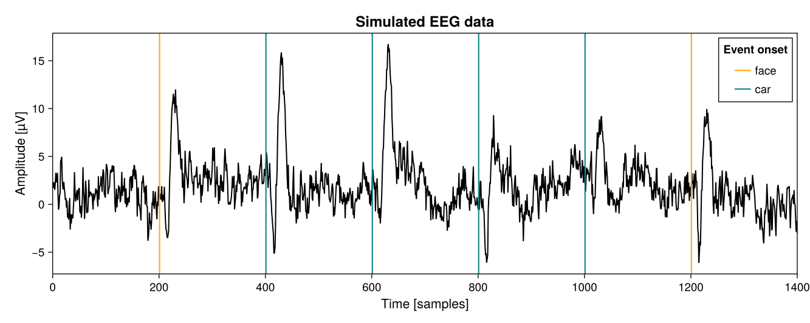

# Summary

`UnfoldSim.jl` is a Julia package used to simulate multivariate time series, with a focus on EEG, especially event-related potentials (ERPs). The user provides four ingredients: 1) an experimental design, with both categorical and continuous variables, 2) event basis functions specified via linear or hierarchical models, 3) an inter-event onset distribution, and 4) a noise specification. `UnfoldSim.jl` then simulates continuous EEG signals with potentially overlapping events. Multi-channel support via EEG-forward models is available as well. `UnfoldSim.jl` is modular, providing intuitive entrance points for individual customizations. The user can implement custom designs, components, onset distributions or noise types to tailor the package to their needs. This allows support even for other modalities, e.g. single-voxel fMRI or pupil dilation signals.

# Statement of Need
In our work (e.g. @ehinger2019unfold, @dimigen2021regression), we often analyze data containing (temporally) overlapping events (e.g. stimulus onset and button press, or consecutive eye-fixations), non-linear effects, and complex experimental designs. For a multitude of reasons, we often need to simulate such kind of data: Simulated EEG data is useful to test preprocessing and analysis tools, validate statistical methods, illustrate conceptual issues, test toolbox functionalities, and find limitations of traditional analysis workflows. For instance, such simulation tools allow for testing the assumptions of new analysis algorithms and testing their robustness against any violation of these assumptions.

While other EEG simulation toolboxes exist, they each have limitations: they are dominantly based on the proprietary MATLAB software, they do not simulate continuous EEG, and they offer little support for designs more complex than two conditions or with non-linear effects. In contrast, UnfoldSim.jl is free and open-source and it allows to simulate continuous EEG signals even for complex designs.

# Functionality
The package provides four abstract types: `AbstractDesign`, `AbstractComponent`, `AbstractOnset` and `AbstractNoise`. In the following, we present the concrete types that are currently implemented. In addition, users can also implement their own concrete types fitting their individual needs.

## Experimental designs
Currently, we support a single and a multi-subject design. They are used to generate an experimental design containing the conditions and levels of all predictors. The multi-subject design uses the `MixedModelsSim.jl` package [@phillip_alday_2024_10669002] and allows a flexible specification of the random-effects structure by indicating which predictors are within- or between-subject (or item). Tailored randomisation is possible via a user-specified function, which is applied after design generation. Designs can be encapsulated, for instance, the `RepeatDesign` type which repeats the generated event table multiple times, thus generating new trials. Currently, only balanced designs are implemented, i.e. all possible combinations of predictor levels have the same number of trials. However, [a tutorial on how to implement a new design](https://unfoldtoolbox.github.io/UnfoldSim.jl/dev/generated/HowTo/newDesign) for imbalanced datasets is provided.

## Event basis functions (Components)
`UnfoldSim.jl` provides a `LinearModelComponent` and a `MixedModelComponent` for single- and multi-subject simulation respectively. These components determine the shape of the response to an event. They consist of a basis function which is weighted by the user-defined regression model. The user specifies a basis function for the component by either providing a custom vector or choosing one of the prespecified bases. For example, the package provides simplified versions of typical EEG components e.g. N170 which are implemented as temporally shifted Hanning windows. Further, in the components’ model formulae, fixed-effects ($\beta s$) and random effects  (`MultiSubjectDesign`s only) need to be specified.

Each component can be nested in a `MultichannelComponent`, which, using a forward headmodel, projects the simulated source component to the multi-channel electrode space. Using `Artifacts.jl` we provide on-demand access to the HArtMuT [@harmening2022hartmut] model. 

To generate complex activations, it is possible to specify a vector of `<:AbstractComponents`.

## Inter-onset distributions
The inter-onset distribution defines the distance between events in the case of a continuous EEG. Currently, `UniformOnset` and `LogNormalOnset` are implemented. By specifying the parameters of the inter-onset distribution, one indirectly controls the amount of overlap between two or more event-related responses.
\autoref{fig_onset_distributions} illustrates the parameterization of the two implemented onset distributions.

{height="180pt"}

## Noise types
UnfoldSim.jl offers different noise types: `WhiteNoise`, `RedNoise`, `PinkNoise` and exponentially decaying autoregressive noise (`ExponentialNoise`) (see \autoref{fig_noise_types}). In the future, we will add simple autoregressive noise and noise based on actual EEG data.

{height="250pt"}

# Simulation example
In this section, one can find an example of how to use `UnfoldSim.jl` to simulate continuous EEG data. Additional examples can be found in the [`UnfoldSim.jl` documentation](https://unfoldtoolbox.github.io/UnfoldSim.jl/dev/). Moreover, to get started, the `UnfoldSim.jl` package offers the function `predef_eeg` which, depending on the input, simulates continuous EEG data either for a single subject or multiple subjects.

In the following, we will first provide examples for the four simulation “ingredients” mentioned above which will then be used to simulate data.

1\. We specify an **experimental design** with one subject in two experimental conditions including a continuous variable with 10 values. To mimic randomization in an experiment, we shuffle the trials using the `event_order_function` argument. To generate more trials we repeat the design 100 times which results in 2000 trials in total.

```julia
design =
	SingleSubjectDesign(;
    	conditions = Dict(
        	:condition => ["car", "face"],
        	:continuous => range(0, 5, length = 10),
    	),
        event_order_function = x -> shuffle(deepcopy(StableRNG(1)), x),
	) |> x -> RepeatDesign(x, 100)
```

\autoref{events_df} shows the first rows of the events data frame resulting from the experimental design that we specified. 

: First five rows extracted from the events data frame representing the experimental design. Each row corresponds to one event. The columns *continuous* and *condition* display the levels of the predictor variables for the specific event.\label{events_df}

| **continuous** | **condition** |
|:---------------|:--------------|
| 2.22222        | face          |
| 4.44444        | car           |
| 3.88889        | car           |
| 1.11111        | car           |
| 0.555556       | car           |

2\. Next, we create a signal consisting of two different **components**. For the first component, we use the prespecified N170 base with an intercept of 5&nbsp;µV and a condition effect of 3&nbsp;µV for the “face/car” condition i.e. faces will have a more negative signal than cars. For the second component, we use the prespecified P300 base and include a linear and a quadratic effect of the continuous variable: the larger the value of the continuous variable, the larger the simulated potential.

```julia
n1 = LinearModelComponent(;
	basis = n170(),
	formula = @formula(0 ~ 1 + condition),
	β = [5, 3],
)

p3 = LinearModelComponent(;
	basis = p300(),
	formula = @formula(0 ~ 1 + continuous + continuous^2),
	β = [5, 1, 0.2],
)

components = [n1, p3]
```

3\. In the next step, we specify an **inter-onset distribution**, in this case, a uniform distribution with width = 0 and offset = 200 which means that the inter-event distance will be exactly 200 samples.

```julia
onset = UniformOnset(; width = 0, offset = 200)
```

4\. As the last ingredient, we specify the **noise**, in this case, Pink noise.

```julia
noise = PinkNoise(; noiselevel = 2)
```

Finally, we combine all the ingredients and simulate data (see \autoref{fig_example_simulated_data}). To make the simulation reproducible, one can specify a random generator.

```julia
eeg_data, events_df = simulate(StableRNG(1), design, components, onset, noise)
```

{height="250pt"}

To validate the simulation results, we use the `Unfold.jl` package [@ehinger2019unfold] to fit an Unfold regression model to the simulated data and examine the estimated regression parameters and marginal effects. For the formula, we include a categorical predictor for *condition* and a non-linear predictor (based on splines) for *continuous*.

```julia
m = fit(
	UnfoldModel,
	[Any => (
        	@formula(0 ~ 1 + condition + spl(continuous, 4)),
        	firbasis(τ = [-0.1, 1], sfreq = 100, name = "basis"),
    	)],
	events_df,
	eeg_data,
)
```

In subplot A of \autoref{fig_example_coefficients_effects}, one can see the model estimates for the different coefficients and as intended there is a condition effect in the first negative component and an effect of the continuous variable on the second (positive) component. The relation between the levels of the continuous variable and the scaling of the second component is even clearer visible in subplot B of \autoref{fig_example_coefficients_effects} which depicts the estimated marginal effects of the predictors. Instead of showing the regression coefficients, we can evaluate the estimated function at specific values of the continuous variable. 

{height="250pt"}

As shown in this example, `UnfoldSim.jl` and `Unfold.jl` can be easily combined to investigate the effects of certain features, e.g. the type of noise or its intensity on the analysis result and thereby assess the robustness of the analysis.

# Related tools
Not many toolboxes for simulating EEG data exist. Nearly all toolboxes we are aware of have been developed in proprietary MATLAB, and most have not received any updates in the last years or updates at all, and have very specific applications (e.g. `EEGg` [@vaziri2023eegg], `SimMEEG` [@herdman2021simmeeg], `SEED-G` [@anzolin2021seed], `EEGSourceSim` [@barzegaran2019eegsourcesim], `simBCI` [@lindgren2018simbci]). 

In the following, we highlight two actively developed MATLAB-based tools: `Brainstorm` [@tadel2011brainstorm] and `SEREEGA` [@krol2018sereega]. Both toolboxes are based in MATLAB and provide forward-simulation of EEG signals. `Brainstorm` especially excels at the visualization of the forward model, and provides interesting capabilities to generate ERPs based on phase-aligned oscillations. `SEREEGA` provides the most complete simulation capabilities with a greater focus on ERP-component simulation, tools for benchmarking like signal-to-noise specification, and more realistic noise simulation (e.g. via random sources). 

In Python, `MNE-Python` [@GramfortEtAl2013a] provides some tutorials to simulate EEG data, but the functionality is very basic. `HNN-Core` [@Jas2023] can simulate realistic EEG data, but as it is based on neurocortical column models and dynamics, its usage is very detailed, realistic and involved.

In contrast to these tools, `UnfoldSim.jl` has a higher-level perspective, uniquely focusing on the regression-ERP aspect. `UnfoldSim.jl` provides functions to simulate multi-condition experiments, uniquely allows for modeling hierarchical, that is, multi-subject EEG datasets, and offers support to model continuous EEG data with overlapping events. Further, the implementation in Julia offers a platform that is free, that actively encourages research software engineering methods, that makes it easy to add custom expansions via the `AbstractTypes`, and finally, if one is not convinced about the elegancy and speed of Julia, it allows for easy and transparent access from Python and R.

# Acknowledgements
Funded by Deutsche Forschungsgemeinschaft (DFG, German Research Foundation) under Germany's Excellence Strategy – EXC 2075 – 390740016. The authors further thank the International Max Planck Research School for Intelligent Systems (IMPRS-IS) for supporting Judith Schepers. Moreover, the authors would like to thank Tanja Bien for her valuable feedback on the paper manuscript.

# Package references
Please note that we only mention the main dependencies of the package here, but the dependencies of the dependencies can be found in the respective `Manifest.toml` files. Furthermore, please note that we only list rather than cite the packages for which we could not find any citation file or instruction.

**Julia** [@Julia-2017], **DataFrames.jl** [@JSSv107i04], **Distributions.jl** [@Distributions.jl-2019; @JSSv098i16], **Documenter.jl** [@Documenter_jl], **DSP.jl**[@simon_kornblith_2023_8344531], **FileIO.jl**, **Glob.jl**, **HDF5.jl**, **HypothesisTests.jl**, **ImageFiltering.jl**, **Literate.jl**, **LiveServer.jl**, **Makie.jl** [@DanischKrumbiegel2021], **MixedModels.jl** [@douglas_bates_2023_10268806], **MixedModelsSim.jl** [@phillip_alday_2024_10669002], **Parameters.jl**, **PrettyTables.jl** [@ronan_arraes_jardim_chagas_2023_10214175], **ProjectRoot.jl**, **SignalAnalysis.jl**, **Statistics.jl**, **StableRNGs.jl**, **StatsBase.jl**, **StatsModels.jl**, **TimerOutputs.jl**, **ToeplitzMatrices.jl**, **Unfold.jl** [@ehinger2019unfold], **UnfoldMakie.jl** [@mikheev_2023_10235220]  

# References
